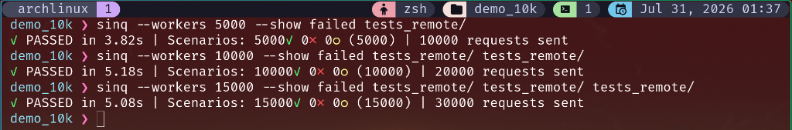

# Introduction to sinq

**sinq** is a concurrent integration and end-to-end HTTP testing tool that treats your filesystem as a workflow definition.

Unlike traditional API testing tools that treat tests as a collection of independent requests, `sinq` is built around the concept of **stateful workflows**. You describe real user flows directly in files, and `sinq` compiles them into executable scenarios that run natively in parallel.

---

## Why sinq?

**Workflow-Oriented Design:** Build authentication, creation, processing, and verification flows as intuitive file trees. Shared setup steps live in parent directories, and leaf directories become isolated, executable scenarios.

**Simple, Transparent Syntax:** A `.sinq` file is a mix of raw HTTP and embedded Lua. There are no heavy abstractions to fight. If you can write a cURL command and a basic script, you can write a `sinq` test. What you write is what gets sent over the network.

**Natively Parallel:** Scenarios do not share global state across their execution contexts. This allows `sinq` to run all scenarios concurrently, bounded only by your network capabilities or configuration limits, significantly reducing test suite execution times.

**Fully Scriptable Lifecycle:** Pass JWTs, correlation IDs, and dynamic payloads between chained requests seamlessly. `sinq` provides dedicated lifecycle hooks (`$PRE`, `$RETRY`, `$ASSERT`, `$POST`) to manage execution flow, handle complex retries, and validate responses natively.

**Lightweight & Built for CI/CD:** Distributed as a single lightweight binary or a minimal container, `sinq` requires almost zero environment setup to run. It natively supports JUnit XML reporting for immediate integration into your deployment pipelines.

---

## Where to go from here?

* **[Getting Started](getting-started.md)**: Learn how to install and run `sinq`.
* **[Scenarios & Configuration](scenario.md)**: Understand the lifecycle of a scenario and how to configure environments.
* **[Lua API Reference](lua-api.md)**: Explore the built-in functions, fake data generators, and cryptography helpers available in your scripts.
